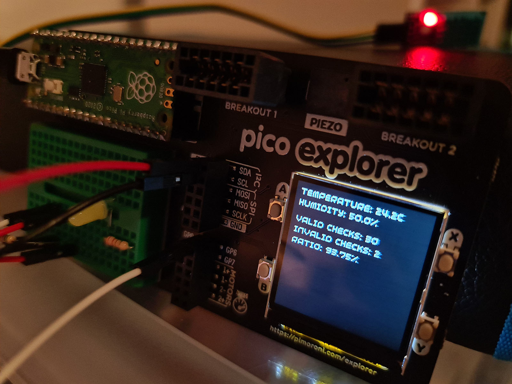

# DHT11 sensor library

A library to read from a DHT11 sensor connected to a Raspberry PIco

## Usage

Inport the DHT11 class from the library and initialise it with the data pin,
configured as a Output with a pull down resistor.
You should wait at least 1 second after powering up the DHT11 sensor befor
reading from it.

You can then read the `.temperature` and `.humidity` property of the instance,
which will be refreshed when accessed if it's not been refreshed in the past 2
seconds

### Example

```python
from machine import Pin
import utime

from dht import DHT11, InvalidChecksum


# Wait 1 second to let the sensor power up
utime.sleep(1)

pin = Pin(0, Pin.OUT, Pin.PULL_DOWN)
sensor = DHT11(pin)

try:
    print("Temperature: {}".format(sensor.temperature))
    print("Humidity: {}".format(sensor.humidity))
except InvalidChecksum:
    print("Checksum from the sensor was invalid")
```

## main.py

This repo contains a main.py file that expects the Pico to be in a [Pico
Explorer Base from Pimoroni](https://shop.pimoroni.com/products/pico-explorer-base),
flashed with [their build of Micropython](https://github.com/pimoroni/pimoroni-pico/releases)

## Issues

For some reason, when polling every two seconds, I'm getting a completely
invalid read 5-10% of the time. Haven't had time to debug it properly yet, but
if `InvalidChecksum` is raised, you can retry in a second and it usually works
at that point. The `main.py` file does show the ratio between valid and invalid
checks.


